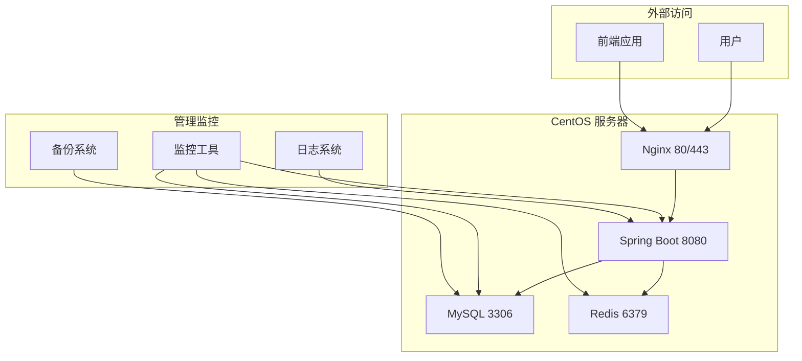

# 宿舍管理系统部署包总览

## 📦 包内容

本部署包包含将宿舍管理系统后端项目部署到 CentOS 服务器的所有必要文件和脚本。

## 📁 文件结构

```
deployment/
├── centos/                          # CentOS 部署文件
│   ├── README.md                   # 详细部署文档
│   ├── deploy-centos.sh            # 完整部署脚本
│   ├── quick-deploy.sh             # 快速部署脚本
│   ├── install-environment.sh      # 环境依赖安装脚本
│   ├── init-database.sql           # 数据库初始化脚本
│   └── package-info.md             # 包信息说明
├── edgeone-final.json              # EdgeOne 前端部署配置
└── DEPLOYMENT-PACKAGE.md           # 本文件
```

## 🎯 部署方案

### 方案一：完整部署（推荐）

适用于生产环境的完整部署，包含所有依赖和详细配置。

**适用场景**：
- 生产环境部署
- 需要完整监控和日志
- 需要高可用性配置
- 需要 Nginx 反向代理

**执行步骤**：
```bash
# 1. 安装环境依赖
sudo ./install-environment.sh

# 2. 初始化数据库
mysql -u root -p < init-database.sql

# 3. 部署应用
sudo ./deploy-centos.sh /path/to/dormitory-management-1.0.0.jar
```

### 方案二：快速部署

适用于快速测试和开发环境的部署。

**适用场景**：
- 开发环境快速搭建
- 功能测试验证
- 演示环境部署

**执行步骤**：
```bash
# 一键快速部署
sudo ./quick-deploy.sh /path/to/dormitory-management-1.0.0.jar
```

## 🔧 系统要求

### 硬件要求
- **CPU**: 2核心以上 (推荐 4核心)
- **内存**: 4GB 以上 (推荐 8GB)
- **存储**: 50GB 以上可用空间
- **网络**: 稳定的互联网连接

### 软件要求
- **操作系统**: CentOS 7.x / 8.x 或 RHEL 7.x / 8.x
- **权限**: root 权限或 sudo 权限

## 📊 部署架构



## 🚀 部署流程

### 1. 准备阶段

#### 本地环境准备
```bash
# 构建应用 JAR 包
cd backend
mvn clean package -DskipTests

# JAR 文件位置
ls target/dormitory-management-1.0.0.jar
```

#### 服务器准备
```bash
# 检查系统版本
cat /etc/centos-release

# 检查磁盘空间
df -h

# 检查内存
free -h
```

### 2. 环境安装

#### 自动安装（推荐）
```bash
# 上传部署文件到服务器
scp -r deployment/centos/ root@your-server:/tmp/

# 执行环境安装
sudo bash /tmp/install-environment.sh
```

#### 手动安装
```bash
# 安装 Java 17
yum install -y java-17-openjdk java-17-openjdk-devel

# 安装 MySQL 8.0
yum install -y https://dev.mysql.com/get/mysql80-community-release-el7-3.noarch.rpm
yum install -y mysql-community-server

# 安装 Redis
yum install -y redis

# 安装 Nginx
yum install -y nginx
```

### 3. 数据库配置

```bash
# 启动 MySQL 服务
systemctl start mysqld
systemctl enable mysqld

# 获取临时密码
grep 'temporary password' /var/log/mysqld.log

# 登录并配置
mysql -u root -p

# 执行初始化脚本
mysql -u root -p < init-database.sql
```

### 4. 应用部署

#### 快速部署
```bash
# 一键部署
sudo bash /tmp/quick-deploy.sh /tmp/dormitory-management-1.0.0.jar
```

#### 完整部署
```bash
# 完整部署
sudo bash /tmp/deploy-centos.sh /tmp/dormitory-management-1.0.0.jar
```

### 5. 验证部署

```bash
# 检查服务状态
systemctl status dormitory-backend

# 检查端口监听
netstat -tlnp | grep 8080

# 健康检查
curl -f http://localhost:8080/api/actuator/health

# 查看日志
journalctl -u dormitory-backend -f
```

## ⚙️ 配置说明

### 应用配置

主配置文件：`/opt/apps/dormitory-management/config/application-prod.yml`

### 环境变量

环境变量文件：`/opt/apps/dormitory-management/config/.env`

```env
# 数据库配置
DB_HOST=localhost
DB_PORT=3306
DB_NAME=dormitory_management
DB_USERNAME=dormitory_user
DB_PASSWORD=your_secure_db_password

# Redis配置
REDIS_HOST=localhost
REDIS_PORT=6379
REDIS_PASSWORD=your_redis_password

# JWT配置
JWT_SECRET=your_production_jwt_secret_key_here
JWT_EXPIRATION=28800
```

### Nginx 配置

配置文件：`/etc/nginx/conf.d/dormitory-backend.conf`

```nginx
server {
    listen 80;
    server_name your-api-domain.com;

    location /api {
        proxy_pass http://localhost:8080;
        proxy_set_header Host $host;
        proxy_set_header X-Real-IP $remote_addr;
        proxy_set_header X-Forwarded-For $proxy_add_x_forwarded_for;
        proxy_set_header X-Forwarded-Proto $scheme;
    }
}
```

## 📈 监控和维护

### 服务管理

```bash
# 启动服务
systemctl start dormitory-backend

# 停止服务
systemctl stop dormitory-backend

# 重启服务
systemctl restart dormitory-backend

# 查看状态
systemctl status dormitory-backend

# 查看日志
journalctl -u dormitory-backend -f
```

### 健康检查

```bash
# 应用健康检查
curl http://localhost:8080/api/actuator/health

# 数据库连接检查
mysql -u dormitory_user -p -e "SELECT 1"

# Redis 连接检查
redis-cli ping
```

### 日志管理

```bash
# 应用日志
tail -f /opt/apps/dormitory-management/logs/application.log

# MySQL 日志
tail -f /var/log/mysql/mysqld.log

# Nginx 日志
tail -f /var/log/nginx/access.log
```

### 备份策略

#### 数据库备份
```bash
# 每日备份
mysqldump -u dormitory_user -p dormitory_management > backup_$(date +%Y%m%d).sql
```

#### 配置备份
```bash
# 备份配置文件
tar -czf config_backup_$(date +%Y%m%d).tar.gz /opt/apps/dormitory-management/config/
```

## 🔒 安全建议

### 数据库安全
- 定期更改数据库密码
- 限制数据库访问 IP
- 启用数据库审计日志
- 定期备份数据库

### 应用安全
- 使用强 JWT 密钥
- 定期更新依赖库
- 启用 HTTPS
- 配置安全头

### 系统安全
- 定期更新系统补丁
- 配置防火墙规则
- 禁用不必要的服务
- 使用非 root 用户运行应用

## 🐛 故障排除

### 常见问题

#### 1. 服务启动失败
```bash
# 查看详细错误日志
journalctl -u dormitory-backend -n 50

# 检查端口占用
netstat -tlnp | grep 8080
```

#### 2. 数据库连接失败
```bash
# 检查 MySQL 服务状态
systemctl status mysqld

# 测试数据库连接
mysql -u dormitory_user -p dormitory_management
```

#### 3. Redis 连接失败
```bash
# 检查 Redis 服务状态
systemctl status redis

# 测试 Redis 连接
redis-cli ping
```

#### 4. 内存不足
```bash
# 检查内存使用
free -h

# 查看 Java 进程内存
ps aux | grep java | awk '{print $6}'
```

### 性能优化

#### JVM 参数调优
```bash
# 编辑服务文件
vim /etc/systemd/system/dormitory-backend.service

# 调整 JVM 参数
Environment=JAVA_OPTS=-Xms1g -Xmx2g -XX:+UseG1GC
```

#### 数据库优化
```sql
-- 查看慢查询
SHOW VARIABLES LIKE 'slow_query_log';

-- 优化索引
EXPLAIN SELECT * FROM students WHERE grade = '2023';
```

## 📞 技术支持

### 联系方式
- **技术支持邮箱**: support@dormitory.com
- **问题反馈**: issues@dormitory.com
- **项目文档**: https://docs.dormitory.com

### 在线资源
- **API 文档**: https://api.dormitory.com/docs
- **代码仓库**: https://github.com/dormitory/management
- **问题追踪**: https://github.com/dormitory/issues

## 📋 部署检查清单

### 环境准备
- [ ] CentOS 系统版本检查
- [ ] 硬件资源满足要求
- [ ] 网络连接正常
- [ ] root 权限获取

### 依赖安装
- [ ] Java 17 安装完成
- [ ] MySQL 8.0 安装完成
- [ ] Redis 安装完成
- [ ] Nginx 安装完成

### 数据库配置
- [ ] MySQL 服务启动
- [ ] 数据库用户创建
- [ ] 数据库初始化脚本执行
- [ ] 数据库连接测试

### 应用部署
- [ ] JAR 文件上传
- [ ] 应用配置文件创建
- [ ] systemd 服务创建
- [ ] 应用服务启动

### 网络配置
- [ ] 防火墙端口开放
- [ ] Nginx 反向代理配置
- [ ] 域名解析配置
- [ ] SSL 证书配置

### 验证测试
- [ ] 应用健康检查通过
- [ ] API 接口访问正常
- [ ] 前端连接成功
- [ ] 日志输出正常

### 监控维护
- [ ] 监控工具配置
- [ ] 备份策略制定
- [ ] 告警规则设置
- [ ] 文档更新完成

---

**版本**: 1.0.0
**更新时间**: 2025-11-16
**维护团队**: Dormitory Management Team
**部署文档版本**: v1.0.0