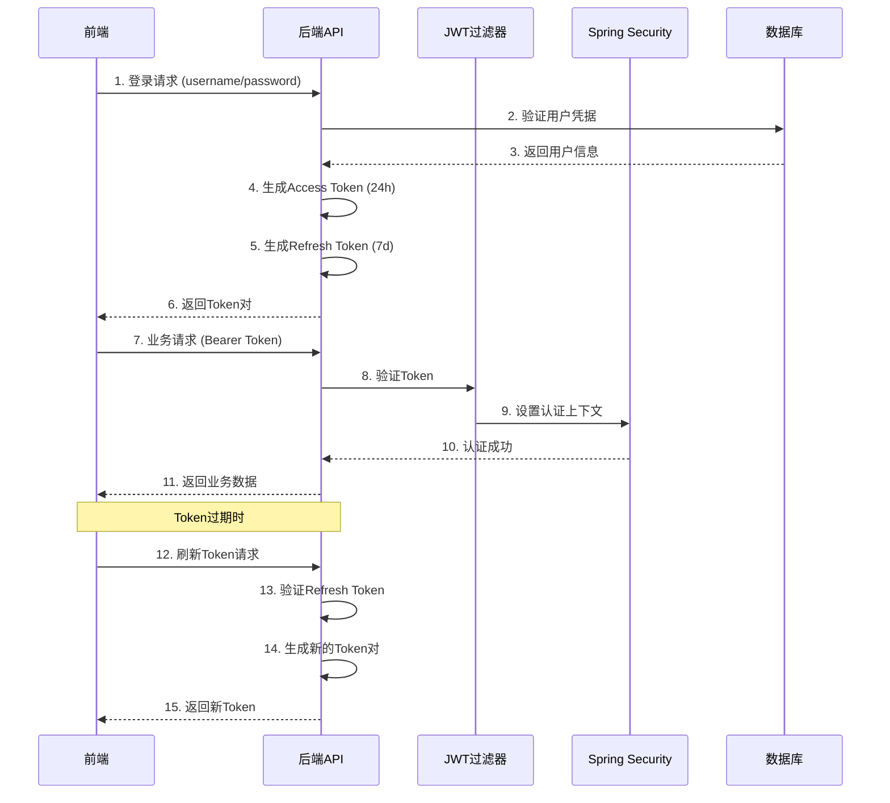

# 认证架构说明

## 概述

本项目采用 **Spring Security + JWT** 的认证架构，替代了原有的Sa-Token方案，提供了更标准和安全的认证机制。

## 技术架构

### 后端认证组件

1. **Spring Security 6.x**
   - 核心安全框架，负责认证和授权
   - 提供过滤器链和上下文管理

2. **JWT (JSON Web Token)**
   - 无状态认证令牌
   - 包含用户ID、用户名、角色等信息

3. **SecurityUtil 工具类**
   - 获取当前认证用户信息
   - 基于Spring Security上下文

### 认证流程



## JWT Token 设计

### Access Token
- **用途**: API请求认证
- **有效期**: 24小时
- **包含信息**: 用户ID、用户名、角色
- **格式**: JWT Compact Serialization

### Refresh Token
- **用途**: 刷新Access Token
- **有效期**: 7天
- **包含信息**: 用户ID、Token类型标识
- **存储**: 前端localStorage

## 配置说明

### application.yml
```yaml
jwt:
  secret: mySecretKey123456789012345678901234567890  # 32位密钥
  expiration: 86400      # 访问令牌过期时间（秒）
  refresh-expiration: 604800  # 刷新令牌过期时间（秒）
```

### Spring Security配置
- **公开端点**: `/user/login`, `/user/register`, `/user/refresh`等
- **认证端点**: 其他所有业务接口
- **无状态会话**: `STATELESS`模式

## 核心类说明

### JwtUtil
```java
@Component
public class JwtUtil {
    // 生成访问Token
    public String generateAccessToken(Long userId, String username, String role)

    // 生成刷新Token
    public String generateRefreshToken(Long userId)

    // 验证Token
    public boolean validateToken(String token)

    // 解析Token信息
    public Long getUserIdFromToken(String token)
    public String getUsernameFromToken(String token)
    public String getRoleFromToken(String token)
}
```

### SecurityUtil
```java
public class SecurityUtil {
    // 获取当前用户ID
    public static Long getCurrentUserId()

    // 获取当前用户信息
    public static UserInfo getCurrentUser(SysUserService sysUserService)

    // 验证是否已认证
    public static boolean isAuthenticated()
}
```

### JwtAuthenticationFilter
```java
@Component
public class JwtAuthenticationFilter extends OncePerRequestFilter {
    // 从请求头提取Token
    // 验证Token有效性
    // 设置Spring Security上下文
}
```

## API接口

### 认证相关
- `POST /user/login` - 用户登录
- `POST /user/logout` - 用户登出
- `POST /user/refresh` - 刷新Token
- `GET /user/info` - 获取当前用户信息

## 前端集成

### Token管理
```typescript
// 用户Store
const token = ref<string>(localStorage.getItem('token') || '')
const refreshToken = ref<string>(localStorage.getItem('refreshToken') || '')

// 登录处理
async function handleLogin(loginParams: LoginParams): Promise<boolean> {
  const response = await login(loginParams)
  token.value = response.token
  refreshToken.value = response.refreshToken
  localStorage.setItem('token', response.token)
  localStorage.setItem('refreshToken', response.refreshToken)
}

// Token刷新
async function refreshAccessToken(): Promise<boolean> {
  const response = await refreshToken(refreshToken.value)
  token.value = response.token
  refreshToken.value = response.refreshToken
}
```

### HTTP拦截器
```typescript
// 请求拦截器 - 添加Token
service.interceptors.request.use((config) => {
  const token = localStorage.getItem('token')
  if (token) {
    config.headers['Authorization'] = `Bearer ${token}`
  }
  return config
})

// 响应拦截器 - 处理401错误
service.interceptors.response.use(
  (response) => response,
  (error) => {
    if (error.response?.status === 401) {
      // Token过期，尝试刷新
      return refreshAccessToken().then(() => {
        // 重试原请求
        return service(error.config)
      })
    }
    return Promise.reject(error)
  }
)
```

## 安全特性

1. **无状态认证**: JWT包含所有必要信息，服务端无需存储会话
2. **Token过期机制**: Access Token短期有效，Refresh Token长期有效
3. **自动刷新**: Token过期时自动尝试刷新，提升用户体验
4. **角色权限**: Token中包含角色信息，支持基于角色的访问控制
5. **安全传输**: 使用HTTPS传输Token（生产环境）

## 迁移说明

### 从Sa-Token迁移到JWT的主要变化：

1. **认证方式**: Session-based → Token-based
2. **配置文件**: 移除sa-token配置，添加jwt配置
3. **拦截器**: SaInterceptor → JwtAuthenticationFilter
4. **用户上下文**: SaTokenUtil → SecurityUtil
5. **前端处理**: satoken header → Authorization Bearer header

### 优势对比

| 特性 | Sa-Token | JWT |
|------|----------|-----|
| 有无状态 | 有状态 | 无状态 |
| 水平扩展 | 受限 | 优秀 |
| 跨域支持 | 复杂 | 简单 |
| 移动端支持 | 一般 | 优秀 |
| 标准化程度 | 框架特定 | 行业标准 |

## 最佳实践

1. **密钥管理**: 生产环境使用强密钥，定期轮换
2. **Token过期**: 根据业务需求设置合理的过期时间
3. **HTTPS**: 生产环境必须使用HTTPS传输
4. **错误处理**: 优雅处理Token过期和刷新失败
5. **日志记录**: 记录认证相关操作用于安全审计